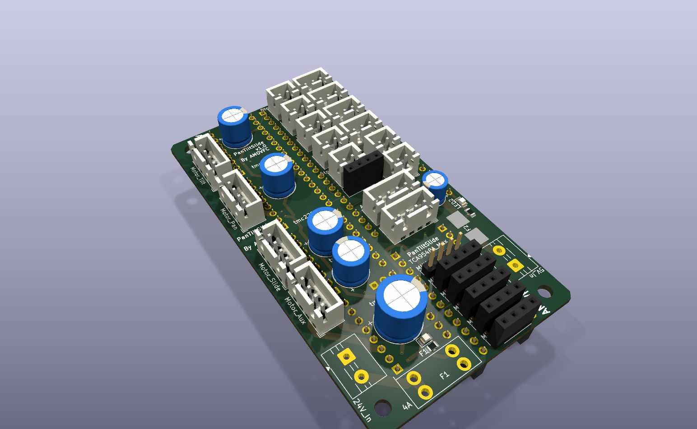
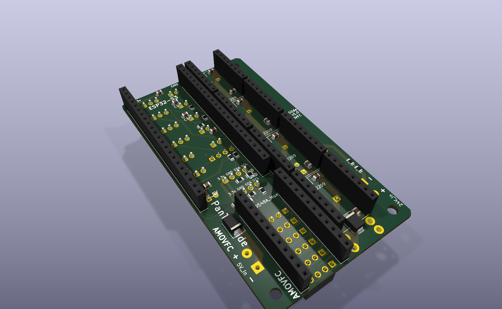

# pantilt-controller — carrier board

The production PCB for the 4-axis camera slider. A carrier for an **ESP32-S3
DevKitC-1** that fans the module out to four **TMC2209 SilentStepStick** driver
sockets, a **TCA9548A** I²C mux, two **AS5600** encoder heads, an OLED, four
quadrature encoders, four buttons and the limit switches — everything on
plug-in connectors — plus on-board power protection on the 24 V and 5 V rails.

Everything that describes a *particular* machine (pin map, mechanics, speeds,
limits) lives in the firmware's runtime config, not on this board. See
[`../software/`](../software/).

|  |  |
|---|---|
|  |  |
| **Top** — every cabled connector (JST-XH, terminal blocks, 1×4 headers for the OLED and spare mux channels), the electrolytics, F1 / F2 and the power LEDs | **Bottom** — the DevKit, TMC2209 and TCA9548A sockets (the modules plug in from underneath), SMD decoupling, I²C pull-ups, TVS diodes |

Renders are `kicad-cli` ray-traces of the board file. F1 and F2 have no 3-D
model and show as bare pads. To regenerate, from this folder:

```bash
kicad-cli pcb render --side top    --rotate "-40,0,35"  --zoom 0.9 --quality high --floor --perspective --background opaque --width 1568 --height 984 --output renders/pantilt-controller-top.png    pantilt-controller.kicad_pcb
kicad-cli pcb render --side bottom --rotate "-40,0,-35" --zoom 0.9 --quality high --floor --perspective --background opaque --width 1568 --height 984 --output renders/pantilt-controller-bottom.png pantilt-controller.kicad_pcb
```

## At a glance

| | |
|---|---|
| Size | 52.3 × 93.2 mm |
| Layers | 4 (1 oz outer + inner) |
| Stackup | `F.Cu` / prepreg 0.1 / `In1.Cu` / core 1.24 / `In2.Cu` / prepreg 0.1 / `B.Cu` ≈ 1.6 mm |
| Planes | `In1.Cu` + `In2.Cu` are both solid GND; F/B carry signal + power |
| Rails | 24 V (motor), 5 V (DevKit + logic), 3.3 V (from the DevKit regulator) |
| DRC | 0 errors, 0 unconnected · 64 warnings, all cosmetic (silkscreen overlap / silk over copper, back-layer text, TMC socket library-copy mismatch) |
| ERC | 0 errors · 96 warnings, mostly off-grid wire endpoints |
| Schematic parity | 30 items — 26 part-field syncs (MPN / LCSC / Notes not yet copied onto the footprints; *Update PCB from Schematic* fixes them without moving anything, since every symbol's footprint matches the board) plus 4 notes on the unnamed `REF**` mounting holes |
| On-silk name | `PanTiltSlide v1.0 · AMOVFC` (silk text predates the `pantilt-controller` project rename) |

## Power and protection

This board is the "mini" carrier **plus** a protection block. Both input rails
are fused, and each has a TVS crowbar downstream of its fuse:

| Ref | Part | Function |
|---|---|---|
| **F1** | XFCN XF-508P-B-B MINI (ATM) blade fuse holder (`C19727305`) with a **4 A** MINI blade fuse (Littelfuse 297/997 or Bussmann ATM — bought separately) | 24 V input fuse |
| **D1** | SMBJ33A uni-directional TVS, cathode→+24 V, anode→GND (`C7427916`) | 24 V crowbar: clamps regen/overvoltage transients; conducts hard on reverse polarity to blow F1 |
| **R29 + R30** | 2 × 10 kΩ in series = 20 kΩ across +24 V / GND | Bleeder — drains the ~870 µF of bulk when the board is off (τ ≈ 17 s), so hand-driving the slide axis can't leave the caps charged. ~29 mW standing. |
| **F2** | Littelfuse 154 OMNI-BLOK 1.5 A slow-blow Nano² fuse **+ holder** assembly (`C206920`) | 5 V input fuse |
| **D2** | SMBJ6.5A uni-directional TVS, cathode→VCC_5V, anode→GND (`C52176732`) | 5 V crowbar, downstream of F2 |
| **LED1 / LED2 / LED3** | red 0805 (Nationstar NCD0805R1, `C84256`) + series R | 24 V / 5 V / 3.3 V present indicators, ≈ 2.2 / 1.4 / 1.4 mA through 10 k / 2.2 k / 1 k. Red's lower forward voltage roughly triples the 3.3 V LED's current compared with the green part it replaced, so all three are clearly visible. |

Bulk capacitance: **C1** 470 µF/50 V at the 24 V fuse output, **C2–C5**
4 × 100 µF/50 V one per driver, **C10** 100 µF/25 V on the 5 V input,
**C12** 22 µF on 3.3 V, plus 100 nF ceramics throughout.

## Connectors

Module sockets are on the bottom; everything that takes a cable is on the top.

| Ref(s) | Label | Type | Goes to |
|---|---|---|---|
| J1, J2 | — | 2 × 22-pin socket, 22.86 mm apart (bottom) | ESP32-S3 DevKitC-1 |
| U1–U4 | tmc2209 | 2 × 1×8 socket each (bottom) | TMC2209 SilentStepStick (pads 17/18 unused) |
| J20, J24 | TCA9548A_Mux | 2 × 12-pin socket (bottom) | TCA9548A breakout |
| J17 / J18 / J19 / J28 | Motor_Slide / Pan / Tilt / Aux | 4-pin JST-XH | stepper coils (A+ A− B+ B−) |
| J21 / J22 | AS5600_Pan / Tilt | 4-pin JST-XH | AS5600 magnet-encoder heads (I²C) |
| J29 / J30 / J31 / J32 | Enc_Slide / Pan / Tilt / Aux | 3-pin JST-XH | panel quadrature encoders |
| J26 / J27 | Limit_Min / Max | 2-pin JST-XH | slide end-stop switches |
| J41 | Aux_Max | 2-pin JST-XH | Z / aux end-stop |
| J33 / J34 / J35 / J36 | Btn_SetKeyframe / ClearKeyframe / PlayPause / Reset | 2-pin JST-XH | panel buttons |
| J23 | OLED | 1×4 male pin header | SSD1306 128×64 I²C OLED |
| J37 / J38 | 5V_In / 24V_In | 5 mm 2-pin terminal block | supplies |
| J3–J8 | MUX_2 … MUX_7 | 1×4 male pin header | breakouts for the 6 spare TCA9548A channels |

Full source→destination GPIO map: [`../software/docs/pinout.md`](../software/docs/pinout.md).

## Bill of materials

Generated from the schematic — [`bom.csv`](bom.csv) is the machine-readable
copy. Grouped by value; `Qty` is total pieces per board. Every LCSC number was
re-checked against LCSC stock and ordered as the build cart on 2026-09-12, and
`bom.csv` and the schematic agree on all 24 parts. The part fields haven't been
copied onto the PCB footprints yet (see *Schematic parity* above).

| Refs | Value | Footprint | Qty | MPN | Mfr | LCSC |
|---|---|---|--:|---|---|---|
| C1 | 470 µF / 50 V | D10 radial, P5.0 | 1 | KM477M050G20RR0VH2FP0 | Chengx | **C34642** |
| C2–C5 | 100 µF / 50 V | D8 radial, P3.5 | 4 | KM107M050F12RR0VH2FP0 | Aishi | **C2749** |
| C6–C9 | 100 nF / 50 V | 0805 | 4 | CC0805KRX7R9BB104 | Yageo | **C49678** |
| C10 | 100 µF / 25 V | D6.3 radial, P2.5 | 1 | KS107M025E07RR0VH2FP0 | Aishi | **C44587** |
| C11, C13–C20 | 100 nF | 0805 | 9 | CC0805KRX7R9BB104 | Yageo | **C49678** |
| C12 | 22 µF / 16 V | 0805 | 1 | HGC0805R5226K160NSLJ | HGC | **C7472967** |
| D1 | SMBJ33A TVS | SMB | 1 | SMBJ33A | NH | **C7427916** |
| D2 | SMBJ6.5A TVS | SMB | 1 | SMBJ6.5A | TDSEMIC | **C52176732** |
| F1 | 4 A MINI blade fuse holder | XF-508P-B-B | 1 | XF-508P-B-B | XFCN | **C19727305** *(fuse bought separately)* |
| F2 | 1.5 A slow-blow + holder | OMNI-BLOK | 1 | 015401.5DR | Littelfuse | **C206920** |
| J1, J2 | 1×22 socket | PinSocket 2.54 | 2 | ZX-PM2.54-1-22PY | Ckmtw | **C7499337** |
| J20, J24 | 1×12 socket | PinSocket 2.54 | 2 | KH-2.54FH-1X12P-H8.5 | Ckmtw | **C2905419** |
| J3–J8, J23 | 1×4 male pin header | PinSocket 2.54 | 7 | PZ2.54-1X4P-H25 | JXTCONN | **C42431787** |
| J17–J19, J28 | 4-pin | JST-XH B4B | 4 | B4B-XH-A(LF)(SN) | JST | **C144395** |
| J21, J22 | 4-pin | JST-XH B4B | 2 | B4B-XH-A(LF)(SN) | JST | **C144395** |
| J29–J32 | 3-pin | JST-XH B3B | 4 | B3B-XH-A(LF)(SN) | JST | **C144394** |
| J26, J27, J33–J36, J41 | 2-pin | JST-XH B2B | 7 | B2B-XH-A(LF)(SN) | JST | **C158012** |
| J37, J38 | 2-pin terminal, 5 mm | MX126-5.0 | 2 | MX126-5.0-02P-GN01-Cu-S-A | MaiXu | **C5188434** |
| LED1–LED3 | red 0805 | 0805 | 3 | NCD0805R1 | Nationstar | **C84256** |
| R1–R4 | 4.7 kΩ | 0805 | 4 | 0805W8F4701T5E | Uniroyal | **C17673** |
| R5–R8, R32 | 2.2 kΩ | 0805 | 5 | 0805W8F2201T5E | Uniroyal | **C17520** |
| R10, R11 | 100 Ω | 0603 | 2 | 0603WAF1000T5E | Uniroyal | **C22775** |
| R12 | 1 kΩ | 0603 | 1 | 0603WAF1001T5E | Uniroyal | **C21190** |
| R25–R31 | 10 kΩ | 0805 | 7 | 0805W8F1002T5E | Uniroyal | **C17414** |
| R33 | 1 kΩ | 0805 | 1 | 0805W8F1001T5E | Uniroyal | **C17513** |
| U1–U4 | TMC2209 socket | 2 × 1×8, 2.54 | 4 | 2.54-1×8P | Ckmtw | **C27438** |

**Not on the LCSC BOM** — bought separately or supplied by the builder:
ESP32-S3 DevKitC-1, 4 × TMC2209 SilentStepStick, TCA9548A breakout, 2 × AS5600
module, SSD1306 OLED, 4 × panel encoder, 4 × panel button, limit switches,
steppers, 24 V PSU, and the 4 A MINI blade fuse for F1.

> R1–R4 (4.7 k) and R5–R8 (2.2 k) are the I²C pull-ups — bus A / the two active
> mux channels. J3–J8 and J23 take male 1×4 headers in `PinSocket_1x04`
> footprints: the copper is identical (2.54 mm pitch, Ø1.0 mm drill), and the
> header's datasheet recommends Ø1.02 mm for its 0.64 mm square pins.

## Manufacturing

1. **Fab the bare PCB** at PCBWay (or any 4-layer house) — standard 1.6 mm,
   1 oz, HASL/ENIG, from the Gerbers you plot out of KiCad. **Refill zones
   (`B`) and save before plotting** — the Gerbers carry whatever copper pour is
   stored in the file, and a stale pour can sit inside the clearance of a part
   that has moved.
2. **Hand-assemble** from the LCSC cart above. PCBWay only warranty parts they
   also place, so the BOM deliberately sticks to common Uniroyal / Yageo
   passives and stocked LCSC parts that are useful on other projects too.
   F1's four holes are drilled Ø1.6 mm, the XFCN datasheet minimum; the
   holder's 0.40 × 1.60 mm flat pins measure 1.65 mm across the diagonal, so
   expect a tight fit — a 1.7 mm reamer opens the holes if it won't seat.
3. [`fp-lib-table`](fp-lib-table) registers the project's `PanTilt` (F1
   holder) and `TMC2209` libraries. U1–U4 still report
   `lib_footprint_mismatch` — the board's embedded socket differs from
   `lib/TMC2209.pretty` — which doesn't affect the Gerbers. The TMC socket's
   courtyard is also malformed in that third-party footprint;
   `malformed_courtyard` is set to *ignore* to match the older boards.

## Folder contents

```
pantilt-controller.kicad_{pcb,sch,pro,prl}   the KiCad 10 project
fp-lib-table                                  registers lib/PanTilt.pretty and lib/TMC2209.pretty
bom.csv                                       BOM export (regenerate with kicad-cli sch export bom)
renders/                                      board renders (kicad-cli pcb render — command above)
lib/PanTilt.pretty                            F1 fuse-holder footprint (XFCN XF-508P-B-B)
lib/TMC2209.pretty, lib/New_Library.kicad_sym the board's TMC socket footprint / symbol deps
tools/pcb_review/                             deterministic DFM review scripts (used by .github/workflows/pcb-review.yml)
```

See the repo root [`README.md`](../README.md) for the project overview and
[`../legacy/`](../legacy/) for the earlier board generations.
